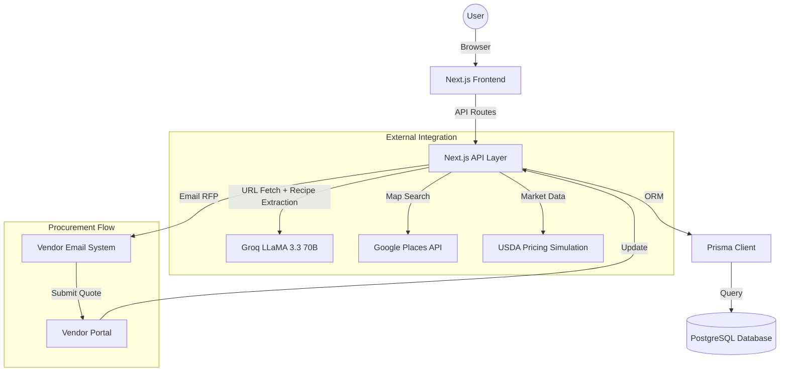
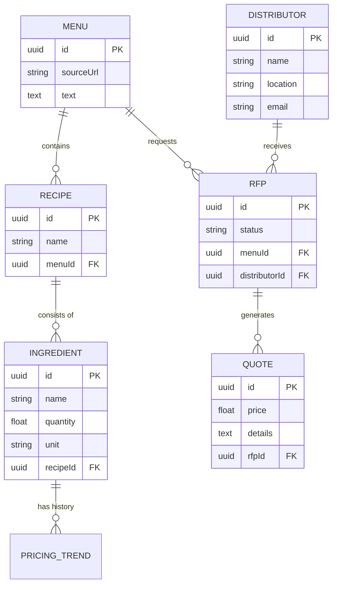

# AutoRFP - Automated Ingredient Procurement System

AutoRFP is a Next.js web application that automates the entire restaurant ingredient procurement pipeline — from AI menu parsing to automated vendor RFP dispatch and AI-powered quote analysis.

## Features

1. **AI Menu Parsing (URL or Text)**: Paste a menu URL *or* raw text. AutoRFP fetches the page server-side, strips the HTML to readable content, and sends it to Groq's LLaMA 3.3 70B model to extract every dish and reverse-engineer the required ingredients and restaurant-scale quantities.
2. **Pricing Trends (USDA Simulation)**: Retrieves (simulated) historical pricing for extracted ingredients, stored in the database and visualized with Recharts over 6 months.
3. **Local Distributor Search**: Uses the Google Places API to find nearby wholesale food distributors by city/zip. Falls back to mocked data if the key is not set.
4. **Automated RFP Dispatch**: Generates a Request for Proposal for all required ingredients and dispatches it to found distributors (email payload is logged to the terminal for safety).
5. **AI Quote Simulation**: Automatically simulates a full multi-turn vendor email conversation using Groq. Vendor quotes are **grounded in real ingredient quantities × market prices** — not random numbers.
6. **AI Final Recommendation**: Groq compares all received quotes against the actual ingredient market pricing from the database and recommends the best vendor with reasoning and savings calculated.
7. **Vendor Quote Portal**: Vendors can also manually submit quotes via a unique `quote/[rfpId]` portal link.

## Tech Stack

- **Frontend**: Next.js 15 (App Router), React, Tailwind CSS, Recharts, Lucide Icons
- **Backend**: Next.js API Routes (Serverless Functions)
- **Database**: PostgreSQL (via Prisma ORM v5)
- **AI**: Groq API — LLaMA 3.3 70B Versatile (via OpenAI SDK compatibility layer)

## System Architecture



## Database Design



## Setup Instructions

1. **Clone the repository** and install dependencies:
   ```bash
   npm install
   ```

2. **Set up Environment Variables**:
   ```bash
   cp .env.sample .env
   ```

   | Variable | Required | Used For |
   |---|---|---|
   | `GROQ_API_KEY` | ✅ Yes | Menu parsing, quote simulation, AI recommendation |
   | `DATABASE_URL` | ✅ Yes | PostgreSQL database |
   | `GOOGLE_MAPS_API_KEY` | ⚠️ Optional | Finding real local distributors (falls back to mock data) |
   | `USDA_API_KEY` | ⚠️ Optional | Real ingredient pricing (falls back to simulation) |

   > 📄 Get a free Groq API key at [console.groq.com/keys](https://console.groq.com/keys). See [`.env.sample`](.env.sample) for full instructions.

3. **Initialize the Database**:
   ```bash
   npx prisma generate
   npx prisma db push
   ```

4. **Run the Development Server**:
   ```bash
   npm run dev
   ```
   Open [http://localhost:3000](http://localhost:3000).

## Sample Menu for Testing

Paste this URL into the **"Paste Restaurant Menu (Text or URL)"** input to test:

```
https://carminesnyc.com/menus/menus-c44-q420-dining
```

The server will fetch the page, extract the readable text, and pass it to Groq for full menu parsing.

## Project Architecture & Routing

| File | Purpose |
|---|---|
| `src/app/page.tsx` | Main dashboard with the 5-step procurement pipeline UI |
| `src/app/quote/[rfpId]/page.tsx` | Vendor portal for submitting quotes |
| `src/app/api/parse-menu/route.ts` | Fetches URL content server-side, then calls Groq for recipe extraction |
| `src/app/api/pricing/route.ts` | Generates/retrieves USDA-simulated 6-month pricing trends |
| `src/app/api/distributors/route.ts` | Google Places API integration for finding local distributors |
| `src/app/api/send-rfp/route.ts` | Generates and dispatches RFP emails, tracks status in DB |
| `src/app/api/simulate-conversation/route.ts` | Groq-powered vendor email simulation using real pricing data |
| `src/app/api/recommend/route.ts` | AI recommendation engine cross-referencing quotes vs. market prices |
| `src/app/api/webhooks/inbound-email/route.ts` | Parses incoming vendor email replies and extracts quoted prices |
| `prisma/schema.prisma` | Database schema: Menus, Recipes, Ingredients, Pricing, Distributors, RFPs, Quotes |

## Notes & Tradeoffs

- **AI Provider**: Uses Groq (free tier, high rate limits) via the OpenAI SDK's compatibility mode (`baseURL` override). The `openai` npm package is still in `package.json` — this is intentional and correct.
- **Real-Priced Quote Simulation**: Vendor quotes are computed from `quantity × market_price` for each ingredient. Vendors quote at a 5–20% margin above cost, making all numbers economically grounded.
- **URL Menu Parsing**: The server fetches the URL and strips HTML before sending to Groq. Groq cannot browse the internet directly.
- **Email Dispatching**: Emails are not sent to real vendors to avoid spamming. The `send-rfp` route logs the email payload to the terminal and tracks state in the database.
- **USDA API**: A deterministic mathematical simulation is used instead of the live API, which is difficult to access and lacks restaurant-grade ingredient data.
- **Robust Demo Mode**: If Groq is unavailable, the app falls back to a comprehensive 12-dish mock menu and calculates plausible prices from that dataset to keep the demo fully functional.
