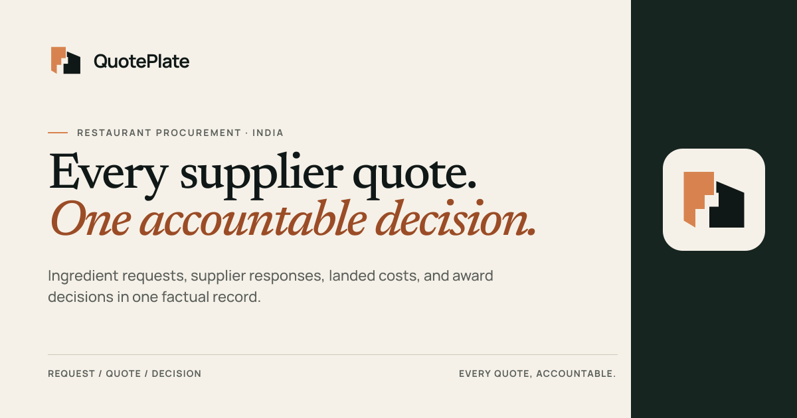

# QuotePlate



QuotePlate is a procurement workspace for restaurants in India. A restaurant can turn a menu into an ingredient request, collect private supplier quotes, compare the real landed cost, record its decision, and repeat the next buying cycle from a factual history.

Built by [Utsav Doshi](https://github.com/Utsavd7).

## Product

QuotePlate covers the complete first release workflow:

- create a menu by typing dish names, uploading up to five photos, taking phone photos, or importing a menu page you have permission to use;
- scan menu photos inside the browser, review the detected text, remove unwanted text, and approve the final dishes and ingredients;
- organise ingredients using categories familiar to Indian restaurants, including vegetables, fruit, dairy, grains, pulses, spices, beverages, bakery, sweets, frozen food, ready food, meat, seafood, and packaging;
- keep current suppliers, add a preferred supplier for an item, choose more than one sourcing route, or accept applications from verified new suppliers;
- send each supplier a private quote link with no supplier account required;
- collect quantities, rates, GST, freight, availability, delivery, substitutions, and payment terms;
- compare complete and incomplete quotes without an automatic purchasing decision;
- award the full request to one supplier or split items across suppliers;
- download request, comparison, award, accounting, QR, supplier, and purchase order records;
- repeat a previous request and use prior buying facts as guidance;
- manage restaurant details, roles, invitations, sign in, sign out, and the optional six step setup guide;
- use the public site and product workspace on phones, tablets, and laptops.

The product does not introduce suppliers and then disappear from the workflow. Its value is the reusable request, quote, decision, purchase order, and price history for every buying cycle.

## ₹0 launch boundary

The controlled pilot accepts up to twenty approved restaurant workspaces. The application load profile checks twenty isolated workspaces locally; live free tier usage still needs monitoring as real restaurants join.

| Need | Launch choice | Cost boundary |
| --- | --- | --- |
| Web application | Netlify Free | Commercial projects are allowed. No card is required and the monthly credit limit is hard. |
| PostgreSQL | Neon Free | No card is required. Compute sleeps when idle and the free plan includes a limited restore window. |
| Menu OCR | Tesseract.js in the browser | Open source. Photos are processed on the user device and no OCR API is called. |
| Sign in | NextAuth with Google OAuth or restaurant credentials | Open source authentication code. Google OAuth itself has no per login API charge. |
| Email and messages | Copyable invitation and supplier links | No email, SMS, or WhatsApp provider is required. |
| Monitoring | Health endpoints and a small canary script | No paid monitoring service is required. |

There is no Stripe integration, payment workflow, card field, paid AI service, vector database, supplier marketplace fee, automatic recharge, or usage priced API in the application. The repository never stores card information.

Unlimited OCR was reviewed and intentionally not added. Its 3 billion parameter, 6.78 GB model needs GPU infrastructure, while browser OCR keeps the pilot simple and free.

## Safety and privacy

- Restaurant data is isolated by workspace at the database layer.
- Supplier links are random, stored only as digests, limited to one request, replaceable, revocable, and time limited.
- Award records preserve the checked prices, quantities, supplier facts, and delivery terms used for the decision.
- Owner only actions protect restaurant settings, team access, supplier verification, and awards.
- Production startup fails closed when required configuration is missing.
- Rate limits cover account creation, invitations, supplier access, supplier submissions, and applications.
- Security headers block framing, content type guessing, browser referrer leakage, and unnecessary device permissions.
- Manual encrypted backup and restore scripts are included. They write only to storage chosen by the operator and never create a paid cloud service.

## Run locally

Requirements: Node.js 24 and PostgreSQL 16.

```bash
npm install
cp .env.sample .env
npx prisma migrate deploy
npm run dev
```

Fill the local environment file with your own values. Never commit it. QuotePlate reads these production variables:

- `DATABASE_URL`
- `DIRECT_URL` for migrations only
- `NEXTAUTH_URL`
- `NEXTAUTH_SECRET`
- `GOOGLE_CLIENT_ID`
- `GOOGLE_CLIENT_SECRET`
- `QUOTEPLATE_PILOT_EMAILS`
- `QUOTEPLATE_RUNTIME_STARTUP_CHECK`

`QUOTEPLATE_PILOT_EMAILS` accepts up to twenty approved owner emails. Production owner creation remains closed to every email outside that list.

## Deploy on the free plans

1. Create or keep the Neon project on the Free plan with no payment method.
2. Apply the committed database migrations with the database owner credential, then set a strong password for the migration created `autorfp_app` runtime role. Do not put the owner credential in the web application.
3. Import this GitHub repository into a Netlify Free account with no payment method. Netlify detects the Next.js application and builds it with `npm run build`.
4. Add the production variables in Netlify. Use only the restricted application database connection at runtime.
5. Add the final HTTPS address and `/api/auth/callback/google` callback in the Google OAuth client.
6. Confirm `/api/health/live` and `/api/health/ready`, then run `CANARY_BASE_URL=https://your-site.example scripts/canary.sh` before inviting a restaurant.

If a provider asks for a card, paid upgrade, overage setting, or automatic recharge, stop and leave the deployment on its existing free limit.

## Recovery

Neon Free supplies its limited restore window. For an additional operator controlled copy, use the included scripts with a dedicated read only database credential:

```bash
BACKUP_DATABASE_URL="..." AGE_RECIPIENT="..." \
  BACKUP_OUTPUT_FILE="/absolute/path/quoteplate.dump.gz.age" \
  scripts/backup-postgres.sh

RESTORE_DATABASE_URL="..." AGE_IDENTITY_FILE="/absolute/path/identity.txt" \
  scripts/restore-verify.sh "/absolute/path/quoteplate.dump.gz.age"
```

Keep backup files and encryption keys in separate operator controlled locations. These scripts do not upload, schedule, subscribe to, or purchase any storage service.

## Verification

```bash
npm test
npm run test:integration
npm run typecheck
npm run lint
npm run build
npm run test:e2e
```

The checks cover access control, tenant isolation, authentication, menu intake, OCR boundaries, supplier lifecycle, quote integrity, landed cost calculations, full and split awards, exports, responsive layouts, accessibility, migrations, and a bounded twenty restaurant load profile. Live Google redirect verification is kept behind the explicit `npm run test:e2e:google-live` command so local tests never pretend to validate Google.

## Project references

- [Brand assets and usage](docs/brand/README.md)
- [India restaurant procurement review](docs/research/india-restaurant-procurement-competitive-review.md)

Repository: [github.com/Utsavd7/QuotePlate](https://github.com/Utsavd7/QuotePlate)
