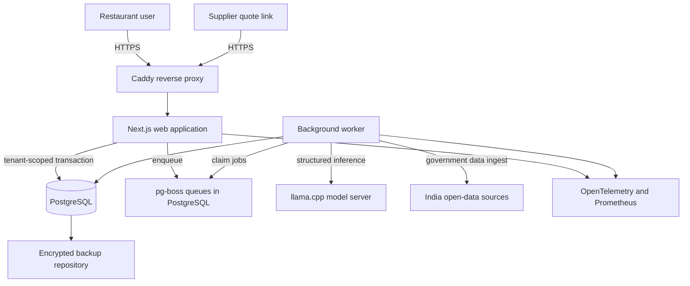

# AutoRFP India-First Production Design

**Status:** Approved by the user for implementation planning

**Date:** 2026-08-27

**Target:** Invite-only production pilot for 1–10 Indian restaurant organizations, validated for 20 organizations and designed to scale beyond that without an application rewrite

**Recurring infrastructure target:** ₹0 while the deployment remains within Oracle Cloud Always Free quotas

## 1. Executive Summary

AutoRFP will become a real ingredient-procurement system rather than a simulated AI demo. The existing Next.js user interface remains the starting point, but the production workflow, security boundary, calculations, data provenance, background processing, and deployment model are rebuilt around deterministic and auditable behavior.

The launch architecture is a single Oracle Cloud Infrastructure (OCI) Always Free Ampere A1 virtual machine in an Indian region. It runs an open-source Docker Compose stack containing Caddy, the Next.js application, a background worker, PostgreSQL, pg-boss, a local llama.cpp model server, and lightweight monitoring. PostgreSQL is the source of truth and enforces organization isolation through native row-level security (RLS). The application does not depend on Redis, Chroma, Inngest, Groq, Sentry, Google Places, Resend, or any paid API.

Restaurants create demand from reviewed menu ingredients, issue RFPs, share secure quote links with suppliers, compare complete landed costs, approve awards, and retain an audit trail. Suppliers do not need accounts at launch. The application generates a cryptographically secure, expiring, revocable link that a restaurant user shares through WhatsApp, email, a device share sheet, or QR code.

AI is an optional asynchronous assistant. It can interpret ambiguous menu text and draft explanations, but it cannot invent prices, perform authoritative financial calculations, select a supplier, award an RFP, or send a negotiation. If the model is slow or unavailable, the procurement workflow continues through deterministic parsing and manual review.

This is production-capable for a controlled pilot, not highly available infrastructure. The design compensates for the single free node with encrypted backups, infrastructure as code, tested restoration, explicit service limits, health monitoring, and a no-rewrite scale path.

## 2. Goals

The production conversion must achieve all of the following:

1. Support real restaurant users and supplier quotes with no simulated operational steps.
2. Isolate every organization's business data at the database layer.
3. Provide a complete menu-to-demand-to-RFP-to-quote-to-award workflow.
4. Make all monetary and quantity calculations deterministic, unit-aware, testable, and auditable.
5. Use actual supplier quotes, restaurant invoice history, and clearly labelled Indian government benchmark data.
6. Operate without a paid API dependency.
7. Use open-source application and runtime components with an auditable license inventory.
8. Run within the stricter current OCI Always Free target of 2 Arm OCPUs and 12 GB RAM.
9. Serve 1–10 organizations initially and pass a defined 20-organization capacity test before broader onboarding.
10. Allow later separation of the web tier, worker, AI inference, and database without changing their public interfaces or rewriting the product.

## 3. Non-Goals

The following are deliberately outside the launch scope:

- Automatic supplier discovery that is treated as verified or authoritative.
- Autonomous negotiation, RFP award, purchase, payment, or supplier messaging.
- A public self-service signup funnel.
- SMS or paid WhatsApp Business API integration.
- Inventory management, warehouse receiving, invoice payment, or accounting-system integration.
- Guaranteed 24/7 high availability on free infrastructure.
- OCR for arbitrary scanned PDFs or photographs. Launch imports support pasted text, CSV, and text-based PDFs; scanned documents receive a clear manual-input fallback.
- International currencies, tax systems, or market-price feeds. Launch currency is INR and launch geography is India.
- Using government market observations as promised restaurant delivery prices.
- Training or fine-tuning a proprietary model.

## 4. Alternatives Considered

### 4.1 Selected: one self-hosted OCI Always Free node

This approach maximizes usable free memory, keeps the data in an Indian OCI region, avoids free-service sleep behavior, and permits every runtime dependency to be self-hosted. A single 2-OCPU/12-GB node is sufficient for normal application traffic and one serialized local-model job, provided that AI never blocks an interactive request.

Trade-offs are single-node availability, possible Always Free capacity shortages, and Oracle's stated right to reclaim idle free compute. Backup and rapid rebuild procedures are therefore release requirements, not later improvements.

### 4.2 Rejected: multiple managed free tiers

A Vercel or Cloudflare frontend combined with Neon, Supabase, Groq, a hosted vector database, and a hosted job service would reduce server administration. It was rejected because the core product would depend on several proprietary quotas, sleeping services, changing free-tier policies, and provider-specific behavior. It also creates multiple failure domains without producing real high availability.

### 4.3 Rejected: home or restaurant-hosted server

This avoids a cloud bill but makes uptime dependent on consumer power, connectivity, routers, and physical access. It also exposes restaurant staff to server administration. It remains a development option, not the production pilot.

## 5. System Architecture



### 5.1 Production containers

The single VM runs these independently restartable services:

- `caddy`: TLS termination, security headers, request-size limits, and reverse proxying.
- `web`: the stateless Next.js application and API routes.
- `worker`: pg-boss consumers, data ingestion, document generation, and asynchronous AI orchestration.
- `postgres`: PostgreSQL with RLS and the pgvector extension available but not required for launch search.
- `llama`: llama.cpp with one loaded quantized model and one inference slot.
- `prometheus`: short-retention metrics collection.
- `grafana`: local operational dashboards with no public anonymous access.
- `backup`: scheduled encrypted database backups and retention enforcement.

Only ports 80 and 443 are publicly reachable. PostgreSQL, llama.cpp, Prometheus, and Grafana bind only to the private container network. Administrative shell access uses OCI Bastion or a source-IP-restricted SSH rule.

### 5.2 Resource budget

The deployment is designed for the following steady-state ceiling:

| Component group | Target memory ceiling |
|---|---:|
| PostgreSQL and pg-boss | 2.5 GB |
| Next.js web and worker | 2.0 GB |
| llama.cpp and quantized model | 4.5 GB |
| Caddy, monitoring, backup, and operating system | 1.5 GB |
| Required headroom | 1.5 GB |

Containers receive memory limits and restart policies. The host is considered unsafe when sustained memory use exceeds 85%, swap activity affects request latency, or the database has less than 20% free disk space.

### 5.3 Storage layout

The VM uses a 100-GB boot volume and a separate 100-GB data volume. PostgreSQL data, generated documents, and retained imports live on the data volume. This separation makes the business-data volume easier to snapshot, reattach, and restore after a VM replacement.

Raw menu imports are retained for 30 days unless a restaurant deletes them sooner. Generated RFP, quote-comparison, and purchase-order documents follow the organization's business-record retention setting, which defaults to three years. Backups follow the independent retention rules in Section 19.

## 6. Open-Source and External-Service Policy

Production runtime libraries and deployable components must use an OSI-approved or similarly permissive open-source license. Model weights must permit commercial use. Every production release produces a software bill of materials and a license report.

Approved launch components include:

| Purpose | Component | License posture |
|---|---|---|
| Web application | Next.js and React | MIT |
| Database | PostgreSQL | PostgreSQL License |
| ORM during migration | Prisma ORM | Apache-2.0 |
| Authentication | Better Auth | MIT |
| Password hashing | `@node-rs/argon2` | MIT |
| Job processing | pg-boss | MIT |
| Local inference | llama.cpp | MIT |
| Default model candidate | Qwen3.5-4B | Apache-2.0 |
| Reverse proxy | Caddy | Apache-2.0 |
| Telemetry | OpenTelemetry and Prometheus | Apache-2.0 |
| Dashboard | Grafana OSS | AGPL-3.0 |
| Browser testing | Playwright | Apache-2.0 |
| Load testing | k6 | AGPL-3.0 |

The external boundaries are OCI infrastructure, official Government of India data services, and an optional Foursquare Open Source Places download. These are infrastructure or data sources, not opaque application logic. No critical workflow depends on a paid API or an uncommitted free trial.

Cloud provider SDKs are avoided where a standard protocol exists. Object backups use an S3-compatible interface; optional account email uses SMTP; telemetry uses OTLP; local inference uses an OpenAI-compatible loopback endpoint. These adapters keep migration possible.

## 7. Actors and Authorization

### 7.1 Restaurant roles

Each user belongs to one or more organizations through a membership. Launch roles are fixed and intentionally small:

- **Owner:** organization settings, locations, members, suppliers, procurement, RFP approval, award, purchase-order generation, exports, and data deletion requests.
- **Procurement manager:** menus, demand, suppliers, RFPs, quotes, comparisons, awards, and exports; cannot manage owners or delete the organization.
- **Viewer:** read-only access to business data and exports; cannot view secret invitation tokens or recovery material.

The browser never supplies an authoritative organization ID. The server derives the active organization from the authenticated session and verifies membership on every request.

### 7.2 Supplier actor

A supplier is not an authenticated restaurant user. A supplier accesses exactly one RFP through an invitation token. The invitation determines the organization, RFP, supplier, expiry, allowed actions, and revocation state.

### 7.3 Platform administration

Platform administration is an operational function, not a hidden application superuser. The web process has no database bypass role. Schema migration, backup, and break-glass recovery use separate credentials that are unavailable to normal web requests. Support personnel cannot browse tenant data through the application at launch.

## 8. Authentication and Account Lifecycle

Better Auth replaces the custom NextAuth credential implementation. It uses the organization, two-factor, and rate-limit capabilities and custom Argon2id password hashing.

Launch account rules are:

- Invite-only account creation.
- Globally unique, normalized email address per human user.
- Minimum password length of 12 characters and maximum length of 128.
- Argon2id parameters benchmarked to take approximately 150–300 ms on the production CPU without exceeding 96 MB per hash.
- TOTP two-factor authentication required for owners and optional for other restaurant users.
- Recovery codes generated once, hashed at rest, and rotated after use.
- Session cookies marked `Secure`, `HttpOnly`, and `SameSite=Lax`.
- Session inactivity expiry of 24 hours and absolute expiry of seven days.
- Password change and role elevation revoke other active sessions.
- Login responses do not reveal whether an email exists.

Because the ₹0 launch is invite-only, account activation and recovery can be delivered out of band by the platform operator. When a trusted sender identity is available, the same flows use standard SMTP through OCI's Always Free email allowance. Supplier RFP delivery does not depend on this email service.

## 9. Tenant Isolation

Application-level query filters are not the security boundary. Every organization-owned table includes a non-null `organization_id` and has PostgreSQL RLS enabled and forced.

Database roles are separated:

- `autorfp_owner`: owns schema and migrations; never used by the running application.
- `autorfp_app`: executes normal web and worker transactions and cannot bypass RLS.
- `autorfp_backup`: read access required for consistent backup and restore verification.

Every authenticated business transaction executes `SET LOCAL app.organization_id = <membership organization>` before accessing tenant-owned tables. Policies compare the row's `organization_id` with this transaction-local value. A missing, invalid, or mismatched setting produces default deny.

Policies cover `SELECT`, `INSERT`, `UPDATE`, and `DELETE`. Creates use `WITH CHECK`; updates prevent changing a row to another organization. The application cannot perform an unscoped query for convenience.

The supplier portal resolves a token hash through one narrowly scoped `SECURITY DEFINER` database function. That function returns only the active invitation identifier and its organization identifier. The application then starts a normal RLS-scoped transaction. Direct execution rights on tenant tables are not granted to a public role.

Automated isolation tests create two organizations and attempt every CRUD operation and relationship traversal from the wrong organization. A release fails if any foreign row, count, existence signal, export, background job, or attachment can cross the boundary.

## 10. Domain Model

The production schema is organized around these bounded areas:

### Identity and tenancy

- `User`
- `Organization`
- `Membership`
- `Location`
- `Session`
- `RecoveryCode`

### Catalog and demand

- `Ingredient`: tenant ingredient linked optionally to a canonical ingredient.
- `CanonicalIngredient`: controlled normalization record with aliases and compatible base-unit dimension.
- `Menu`: a versioned restaurant menu.
- `MenuItem`: a sellable item and expected serving volume.
- `RecipeIngredient`: per-serving ingredient requirement.
- `DemandRun`: immutable calculation input and output snapshot for a date range.
- `DemandLine`: required base quantity plus procurement packaging preference.

### Suppliers and procurement

- `Supplier`: tenant-owned and manually verified supplier record.
- `SupplierContact`: contact details with provenance and verification state.
- `Rfp`: procurement request identity, lifecycle state, deadline, and amendment lineage.
- `RfpVersion`: immutable issued terms and requested-line snapshot.
- `RfpLine`: requested ingredient, specification, quantity, unit, and delivery location belonging to one RFP version.
- `RfpInvitation`: supplier-specific public access grant scoped to one RFP version.
- `Quote`: supplier response envelope.
- `QuoteVersion`: immutable revision submitted by the supplier.
- `QuoteLine`: price, pack size, MOQ, tax, availability, and substitutions.
- `Award`: explicit restaurant approval with rationale.
- `AwardLine`: full or split award by RFP line.
- `PurchaseOrder`: generated record derived from an approved award.

### Evidence and operations

- `PriceObservation`: government, invoice, or quote price evidence with source and freshness.
- `InvoiceObservation`: restaurant-entered historical paid cost.
- `ImportJob`: source file, status, validation issues, and result.
- `AuditEvent`: append-only actor, action, entity, time, request ID, and safe metadata.
- `OutboxEvent`: database-committed event awaiting asynchronous handling.

Business records use UUIDv7 identifiers. Every mutable aggregate includes a version number for optimistic concurrency. User-visible destructive operations use soft deletion where financial history or auditability requires retention; raw imports and unreferenced drafts can be hard-deleted under the stated retention policy.

## 11. Procurement State Machines

RFP state is controlled by the server and cannot be set arbitrarily by the client:

```text
DRAFT -> APPROVED -> OPEN -> CLOSED -> AWARDED -> PURCHASE_ORDER_CREATED
  |          |         |       |
  +----------+---------+-------+-> CANCELLED

OPEN -> SUPERSEDED
```

Rules include:

- Only a reviewed demand snapshot can create an RFP.
- Opening an RFP freezes the issued RFP version and its line quantities.
- An open RFP never changes in place. An amendment creates a new draft RFP linked to the prior RFP through `supersedes_rfp_id`.
- When the replacement RFP opens, the prior RFP becomes `SUPERSEDED`, all prior invitations are revoked, and prior quotes remain historical. Suppliers must submit against the replacement invitation; old quotes are never silently carried forward.
- Closing prevents new quote versions but preserves submitted quotes.
- Award totals cannot exceed requested quantities unless the owner records an explicit overage reason.
- A purchase order is generated only from a committed award.
- Cancellation is append-only history; it does not delete the RFP or quotes.

Quote state is `DRAFT`, `SUBMITTED`, `REVISED`, `WITHDRAWN`, or `EXPIRED`. A supplier can revise before the deadline if the invitation permits it. Every submission creates a new immutable quote version; comparison uses the latest valid version and shows the revision history.

## 12. End-to-End User Flow

### 12.1 Onboarding

1. The platform operator creates an owner invitation.
2. The owner activates the account, sets a password, enrolls TOTP, and creates the organization profile.
3. The owner adds one or more restaurant locations with INR, Indian timezone, delivery address, and purchasing preferences.

### 12.2 Menu and demand

1. A user pastes text, uploads CSV, or uploads a text-based PDF no larger than 10 MB and 100 pages.
2. The deterministic parser extracts known quantities, units, ingredients, and menu structure.
3. Ambiguous lines are placed in a review queue. The local model can propose a structured interpretation asynchronously.
4. A user confirms recipes, serving quantities, expected covers, planning dates, waste percentage, and safety stock.
5. The server creates an immutable demand snapshot and uses its scaled `DemandLine` values for the RFP. It never falls back to per-serving recipe quantities in the quote portal.

### 12.3 RFP creation and sharing

1. A procurement manager selects a demand snapshot, delivery location, deadline, commercial terms, and suppliers.
2. The application validates compatible units and opens an approved RFP.
3. It generates one supplier-specific invitation link per selected supplier.
4. The user shares the link through the native device share sheet, a WhatsApp deep link, an email composer, copied text, or QR code.

### 12.4 Supplier quote

1. The supplier opens the link without an account.
2. The portal shows restaurant identity, deadline, requested items, quantities, specifications, delivery location, and terms.
3. The supplier enters pack size, number of packs, price per pack, applicable GST, freight, discount, MOQ, available quantity, delivery date, quote validity, and notes.
4. The portal shows calculated line and quote totals before submission.
5. Submission writes an immutable quote version and a receipt reference. The raw token is never logged.

### 12.5 Comparison, award, and purchase order

1. The system normalizes comparable quote lines and flags incompatible units or missing commercial terms.
2. Users see total landed cost, item coverage, delivery fit, quote validity, substitutions, and supplier history.
3. The application recommends no winner by hidden AI judgment. Sorting and scoring use visible deterministic weights.
4. An owner or procurement manager selects a full or split award and records the decision rationale.
5. The system creates an auditable award and a purchase-order record suitable for PDF/CSV export and manual sharing.

## 13. Supplier Invitation Security

Each invitation token contains at least 256 bits of cryptographic randomness. The raw token appears only in the generated URL and is never stored. PostgreSQL stores an HMAC-SHA-256 lookup value using a separate server secret so a database-only leak does not expose usable links.

Invitation rules are:

- Default expiry at the RFP deadline, with an absolute maximum of 30 days.
- Scope limited to one RFP and one supplier.
- Immediate revocation supported.
- Replacement generates a new token and revokes the previous token.
- Read requests limited to 60 per minute per token and IP pair.
- Write requests limited to 10 per minute per token and IP pair.
- Five failed validation submissions in ten minutes trigger a 15-minute cooldown.
- Request and validation logs redact token paths, supplier contact details, and quote text.
- Supplier responses use optimistic version checks. Stale submissions return HTTP 409 with the latest safe state.

Public pages use a restrictive Content Security Policy, no third-party analytics, no indexing, and `Referrer-Policy: no-referrer` so tokens are not leaked to external sites.

## 14. Money, Units, and Financial Correctness

### 14.1 Money representation

Currency is fixed to INR at launch. Whole monetary values are stored as integer paise. Quantities use PostgreSQL `NUMERIC(18,6)`. Calculations use decimal arithmetic on the server; JavaScript binary floating point is not authoritative.

For each quote line:

```text
packs_required = ceiling(requested_base_quantity / pack_base_quantity)
pre_tax_line = packs_required * price_per_pack_paise
discount = explicit fixed or basis-point discount
taxable_line = pre_tax_line - discount
gst = round_half_up(taxable_line * gst_basis_points / 10000)
line_landed_cost = taxable_line + gst + allocated_line_freight
```

Each line can contain either a fixed-paise discount or a basis-point discount, never both. GST basis points are supplier-entered per line and are not inferred from an ingredient name. Quote-level freight and quote-level discounts are allocated proportionally by pre-tax line value only for analytical line comparisons. Their original quote-level values remain stored, and allocated values must sum exactly to the originals; the final line absorbs any rounding remainder.

### 14.2 Canonical units

Canonical base dimensions are:

- Mass: gram (`g`)
- Volume: millilitre (`ml`)
- Count: each (`ea`)

Procurement packaging is represented separately as pack base quantity and pack count. Kilograms and litres convert exactly to their base dimensions. The system does not convert mass to volume without an explicit, reviewed ingredient-specific density rule. Count-to-mass conversions also require a reviewed rule with provenance.

Every conversion records input value, input unit, output value, output unit, conversion rule, and rule version. Unit mismatch blocks comparison instead of silently guessing.

### 14.3 Savings definition

Displayed savings use this baseline order:

1. The restaurant's most recent comparable paid landed cost for the same ingredient and location.
2. The median of valid comparable supplier quotes for the current RFP.
3. No savings figure.

Government observations provide market context and risk signals, not the savings baseline. Hypothetical savings across mutually exclusive vendors are never summed. If the baseline is absent or incompatible, the UI states `Baseline unavailable`.

## 15. India Data Strategy

### 15.1 Price evidence

The ingestion worker retrieves and stores:

- AGMARKNET daily market-level minimum, maximum, and modal commodity prices from the Open Government Data Platform India.
- Department of Consumer Affairs daily retail and wholesale observations for monitored essential commodities.
- Restaurant-entered historical invoice prices.
- Actual supplier quote and awarded prices produced inside AutoRFP.

Each `PriceObservation` stores source type, source record identifier, source URL, observed date, ingested date, commodity, variety, market, district, state, raw unit, raw value, normalized value, mapping version, and quality flags.

The UI labels government values as `Market benchmark`, identifies wholesale or retail, names the market or geographic aggregation, and displays the observation date. It never labels cached or generated data as live. If ingestion fails, the last successful observation remains available with a stale warning.

Commodity mapping is reviewed and versioned. Ambiguous mappings are excluded from automatic comparisons. The application never fills a missing government price with an LLM-generated value.

### 15.2 Supplier data

The organization's manually confirmed supplier record is authoritative. Foursquare Open Source Places can seed candidate businesses for a selected Indian locality, but imported records are visibly marked `Unverified candidate` until a restaurant user confirms the business and contact details.

The launch system does not use public Nominatim as a generic search or autocomplete service. Addresses are entered manually; coordinates can come from an approved offline dataset or user-selected map point in a later scoped feature.

### 15.3 Data refresh

- Government price ingestion runs daily after the source's normal publication window.
- A source is stale after two expected publication intervals.
- Source format changes fail closed, retain the prior data, and alert operations.
- Raw source responses are checksummed and retained for 30 days for reproducibility.

## 16. AI Design

### 16.1 Runtime and model selection

llama.cpp serves a quantized Qwen3.5 model on the private container network. The production candidate is Qwen3.5-4B in a commercially usable Apache-2.0 quantization. Qwen3.5-2B is the fallback when the exact OCI benchmark fails the resource or latency gates below.

The launch inference configuration is:

- One concurrent inference request.
- Maximum context of 8,192 tokens.
- Non-thinking mode for extraction and classification.
- Schema-constrained JSON output.
- Five-minute hard job timeout.
- At most one repair attempt after schema failure.
- No internet access from the model container.

The 4B candidate becomes the default only if a benchmark on the actual production shape meets all of these gates:

- Peak host memory remains below 85%.
- Median completion time is no more than three minutes for the representative pilot menu set.
- 100% of accepted outputs validate against the required schema after no more than one repair.
- Ingredient extraction F1 is at least 0.90 on a hand-labelled set of 50 representative Indian menu lines.
- Explicit quantity and unit exact-match accuracy is at least 0.95.

If any gate fails, Qwen3.5-2B is used. The benchmark result, model hash, quantization, prompt version, and evaluation set hash are retained.

### 16.2 Permitted AI tasks

- Propose structured interpretations for ambiguous menu lines.
- Suggest canonical ingredient aliases for human approval.
- Summarize quote differences using already calculated facts.
- Draft negotiation text that a user must review and manually share.
- Explain deterministic risk factors in plain language.

### 16.3 Prohibited AI authority

- Creating or fabricating any price observation.
- Performing the authoritative financial or unit calculation.
- Changing demand, an issued RFP, a submitted quote, an award, or a purchase order.
- Selecting or awarding a supplier.
- Sending supplier communication.
- Treating model confidence as evidence.

Every accepted AI suggestion stores the model, prompt version, input hash, output, validator result, accepting user, and final edited value. Rejected suggestions remain operational telemetry for evaluation but are removed according to the 30-day raw-input retention policy.

## 17. Background Processing

pg-boss replaces Inngest. The business transaction writes an `OutboxEvent` atomically with the state change and audit event. A dispatcher converts undispatched outbox rows into pg-boss jobs using the outbox identifier as the job idempotency key, then marks the row dispatched. A crash at any point is safe to retry. Job handlers remain idempotent even though the queue provides strong delivery semantics.

Launch queues are:

- `menu.parse`
- `menu.ai-review`
- `price.agmarknet.ingest`
- `price.consumer-affairs.ingest`
- `document.generate`
- `audit.export`
- `retention.enforce`
- `backup.verify`

Defaults are three retries with exponential backoff and jitter, a task-specific expiry, and dead-letter retention of 14 days. A job records `organization_id`, actor, correlation ID, input schema version, and idempotency key. Workers establish RLS context before tenant access.

Long-running AI jobs are serialized globally on the free VM. Normal jobs are allowed two concurrent workers. Queue depth and oldest-ready-job age are monitored. The application displays queued, running, completed, failed, and manual-fallback states instead of pretending that background work succeeded.

## 18. API and Error Handling

All internal API routes require authentication and organization membership unless explicitly designated as supplier-portal or health endpoints. Routes use shared request guards rather than individually reimplementing authentication.

API behavior includes:

- Runtime request and response validation with versioned schemas.
- RFC 9457-style problem details for errors.
- Correlation ID on every response and job.
- Idempotency keys for RFP open, quote submit, award, purchase-order creation, and import creation.
- Database transactions around state changes and their audit/outbox records.
- Optimistic concurrency with HTTP 409 on stale mutation.
- HTTP 422 for business-rule violations with field-level corrections.
- HTTP 429 with `Retry-After` for rate limiting.
- Safe generic HTTP 500 responses; internal details appear only in redacted structured logs.

Arbitrary remote URL fetching is removed from launch. This eliminates the present server-side request-forgery path. If URL import is designed later, it requires a separate threat model covering DNS rebinding, redirects, private and link-local networks, size limits, content sniffing, timeouts, and an explicit allowlist.

## 19. Backups and Disaster Recovery

The free single-node deployment is releasable only after restoration is tested.

Backup policy:

- Continuous WAL archiving to encrypted OCI Object Storage through an S3-compatible endpoint.
- Nightly compressed PostgreSQL full backup.
- Seven daily restore points and four weekly restore points while their compressed backups plus retained WAL fit within a 14-GB repository budget, leaving 6 GB of the free object quota as operating headroom.
- Daily data-volume backup with a rolling maximum of five OCI Always Free volume backups.
- Weekly encrypted logical export copied to an operator-controlled offline location.
- Backup encryption key stored outside the VM and outside the repository.
- Automated checksum and catalog verification after every backup.
- Monthly database restore into an isolated temporary database.
- Quarterly full infrastructure rebuild and application-level journey verification.

Pilot recovery objectives are:

- Recovery point objective: no more than 15 minutes of committed database changes.
- Recovery time objective: no more than two hours after infrastructure capacity is available.

If OCI has no replacement A1 capacity in the home region, the incident is declared an infrastructure-capacity outage. The operator restores temporarily to approved paid or local capacity only after explicit authorization; the free design does not silently create billable resources.

## 20. Observability and Operations

The application and worker emit structured JSON logs through Pino and traces/metrics through OpenTelemetry. Prometheus retains seven days of high-resolution metrics; Grafana is private and authenticated.

Required dashboards and alerts cover:

- HTTP rate, p50/p95/p99 latency, and error rate.
- Authentication failures and rate-limit activations.
- PostgreSQL connections, slow queries, locks, cache hit rate, WAL/archive state, and disk growth.
- Queue depth, oldest job age, retry count, and dead-letter count.
- AI queue time, inference time, schema failures, fallbacks, and memory use.
- Government-data freshness and parsing failures.
- Backup age, verification result, and available restore points.
- Host CPU, memory, swap, filesystem space, and container restart count.

Application health endpoints are split into:

- `/health/live`: process is responsive; no dependency calls.
- `/health/ready`: database connection, migration version, and critical configuration are valid.

The same-node monitor detects component failures. An OCI free synthetic monitor or notification check is used for whole-host outage detection; this is an infrastructure boundary and not an application runtime dependency.

Audit events intentionally exclude passwords, raw session tokens, supplier invitation tokens, recovery codes, complete uploaded files, and model chain-of-thought. Security-relevant audit events are retained for at least one year.

## 21. Privacy and India Readiness

The system is designed for data minimization and the phased requirements of India's Digital Personal Data Protection Act, 2023 and notified Digital Personal Data Protection Rules, 2025. This specification is an engineering control set, not a substitute for legal review before a broad commercial launch.

Launch controls include:

- A clear privacy notice identifying collected user, supplier-contact, and operational data.
- Purpose limitation to procurement operation, account security, service support, and required auditing.
- Collection of only necessary supplier contact information.
- Organization-level export of personal and business data.
- A documented correction and deletion request path.
- Retention enforcement rather than indefinite raw-file storage.
- Breach-response runbook, affected-data identification, audit preservation, and notification decision workflow.
- Indian OCI home region for primary data and backups.
- No use of restaurant or supplier data to train public or shared models.
- No third-party advertising or behavioral analytics on authenticated or supplier pages.

The owner is responsible for confirming that supplier contact information was obtained for a lawful business purpose. Foursquare candidate data is not copied into a tenant's confirmed contact book until a user confirms it.

## 22. Security Controls

The production baseline includes:

- TLS with automatic renewal through Caddy.
- Strict Transport Security after domain and certificate validation.
- Content Security Policy without unsafe third-party scripts.
- `X-Content-Type-Options: nosniff`, restrictive permissions policy, and frame denial.
- CSRF protection on cookie-authenticated mutations.
- Database-backed rate limiting; memory-only limiting is insufficient across process restarts.
- Secret management through SOPS and age or runtime-injected Docker secrets.
- No production secret, key prefix, or token in a debug response or log.
- Non-root application containers and read-only filesystems where practical.
- Dependency images and packages pinned to reviewed versions.
- Automated secret scanning, dependency scanning, container scanning, and SBOM generation.
- Menu upload type, size, page, parse-time, and decompression limits.
- Database and model services inaccessible from the public network.
- Backups encrypted in transit and at rest with a key outside OCI.

The existing public debug route, Groq key disclosure, unauthenticated sensitive APIs, and unrestricted menu URL fetch are release blockers and are removed in the first implementation phase.

## 23. Performance and Capacity Targets

The pilot is considered ready for 20 organizations only after a production-equivalent ARM64 test passes with:

- 20 organizations and five users per organization.
- 5,000 total suppliers.
- 2,000 RFPs and 20,000 quote lines in the test database.
- 20 concurrent authenticated users performing a representative read/write mix.
- A burst of ten supplier quote submissions per second for ten seconds.
- Less than 1% HTTP error rate excluding deliberate validation and throttling errors.
- p95 under 750 ms for authenticated non-AI API requests.
- p95 under one second for supplier quote reads and submissions.
- No tenant-isolation failure, duplicate quote version, lost audit event, or inconsistent award total.
- Database CPU returning below 60% within two minutes after the burst.
- Core procurement traffic remaining within its latency target while one AI job is active.

Pilot service objectives are 99.5% monthly application availability, a 15-minute database RPO, and a two-hour RTO after compute capacity is available. These are operational targets, not a cloud SLA.

The weekly scale review measures the following conditions:

- p95 interactive latency above target.
- AI queue age above ten minutes during normal business hours.
- Sustained database CPU above 60%.
- Sustained host memory above 80%.
- Database data plus required backup retention above 70% of available storage.
- More than 50 active organizations or 250 active users.

A scale action is triggered when any one condition is observed in two consecutive weekly reviews. Failure to fit the minimum backup retention inside the 14-GB repository budget triggers an immediate onboarding freeze rather than deletion of required restore points. The first scale action separates AI inference from the core node. The second separates PostgreSQL. The third adds stateless web replicas behind a load balancer. The application protocols and data model do not change during these moves.

## 24. Testing Strategy

### 24.1 Unit tests

Unit tests cover:

- All unit conversions and incompatible-dimension failures.
- Money, tax, discount, freight allocation, MOQ, pack rounding, and split awards.
- Demand scaling, waste, and safety-stock calculations.
- RFP and quote state transitions.
- Invitation expiry and revocation.
- Price-source mapping and freshness.
- Deterministic supplier comparison and savings baseline selection.

Financial tests include boundary values, zero quantities, fractional packages, maximum supported values, and property-based invariants such as totals equalling the sum of rounded lines.

### 24.2 Database integration tests

Tests run against real PostgreSQL with migrations and the non-owner application role. They cover RLS for every tenant table, supplier token resolution, transactions, optimistic concurrency, idempotency, outbox atomicity, and pg-boss worker context.

### 24.3 API and journey tests

Playwright exercises:

1. Owner activation and TOTP.
2. Organization and location setup.
3. Menu import and manual review.
4. Demand creation.
5. RFP approval and opening.
6. Supplier link sharing.
7. Supplier quote submission and revision.
8. Restaurant comparison and split award.
9. Purchase-order export.
10. Audit export and permission denial for a viewer mutation.

The journey suite also verifies expired, revoked, malformed, and reused invitation links.

### 24.4 Security and resilience tests

- Cross-tenant CRUD and inference-job isolation.
- CSRF, XSS, token leakage, open redirect, file-parser limits, and authorization coverage.
- Static secret scan and container vulnerability scan.
- Process restart during a job and during quote submission.
- Government source outage and schema change.
- Model timeout and invalid JSON.
- Database backup restoration and full host rebuild.

### 24.5 Release quality gates

A production deployment requires:

- Zero TypeScript errors.
- Zero lint errors and no unreviewed `any` in financial, authorization, tenancy, or API-boundary code.
- Passing unit, integration, journey, security, and migration tests.
- Passing 20-organization load test.
- Successful restoration from the latest encrypted backup.
- No critical or high known vulnerability without a documented, time-bounded exception approved by the owner.
- Signed-off open-source license inventory and SBOM.

## 25. Deployment and Release Process

Infrastructure is described declaratively and can rebuild the VM, network rules, volumes, and object bucket. Application images are built for ARM64, run as non-root users, and are pinned by digest in production.

Release sequence:

1. CI runs all quality gates except the full production load and restore drills.
2. A database backup and migration preflight complete.
3. The new images are pulled and migrations run with the migration role.
4. The worker is paused, the web container is replaced, and readiness is verified.
5. The worker resumes and a synthetic menu-to-quote canary runs in a dedicated canary organization.
6. Failure returns traffic to the previous application image. Schema migrations are forward-compatible for at least one release so application rollback remains possible.
7. Deployment version, migration version, image digests, and canary result are recorded.

No deployment command creates a paid OCI resource. The tenancy remains Always Free-only during the pilot, and quotas/alerts are configured to detect configuration drift.

## 26. Migration from the Existing Project

The production conversion proceeds in seven gated phases, numbered 0 through 6.

### Phase 0: stop unsafe and misleading behavior

- Remove public debug/key disclosure.
- Disable unauthenticated sensitive routes.
- Remove arbitrary remote menu fetching.
- Remove synthetic `live` price labels and fabricated savings.
- Add a temporary feature flag around incomplete RFP sending, quote simulation, recommendation, and negotiation behavior.

Exit gate: the existing deployment cannot expose secrets, cross tenant boundaries, fetch arbitrary internal URLs, or present generated prices as real.

### Phase 1: identity, tenancy, and schema foundation

- Introduce Better Auth organizations, memberships, roles, TOTP, Argon2id, and database-backed rate limits.
- Add organization IDs and constraints to tenant tables.
- Create separate database roles and forced RLS policies.
- Add audit events, outbox events, version columns, and tenant-isolation tests.
- Migrate existing development records into an explicit demo organization; no ambiguous tenant record enters production.

Exit gate: all internal endpoints derive tenant context from an authenticated membership and every tenant table passes cross-organization CRUD tests.

### Phase 2: real deterministic procurement workflow

- Implement versioned menu import and review.
- Correct demand scaling and canonical unit handling.
- Implement RFP state machine and issued versions.
- Implement secure supplier invitations and versioned quote submission.
- Implement landed-cost comparison, award, purchase-order records, and exports.
- Replace the monolithic procurement client component with bounded workflow components and server-owned state.

Exit gate: the complete non-AI Playwright journey succeeds for two isolated organizations, including concurrent quote revisions and split award.

### Phase 3: India evidence and supplier data

- Add AGMARKNET and Consumer Affairs ingestion with source snapshots, mapping versions, freshness, and stale behavior.
- Add invoice-history entry/import.
- Add Foursquare open-data candidate import as an optional offline operation.
- Replace all simulated price and supplier claims.

Exit gate: every displayed external fact links to provenance and date, and missing evidence produces an explicit unavailable state.

### Phase 4: local AI assistant

- Add pg-boss worker and remove Inngest.
- Add llama.cpp adapter and the 4B-versus-2B production benchmark.
- Add schema-constrained menu suggestions, summaries, and reviewed drafts.
- Remove Groq, Chroma, and LangGraph runtime dependencies. The approved launch architecture requires none of them.

Exit gate: AI failure, timeout, or disablement leaves the complete procurement workflow usable, and the selected model passes the stated benchmark.

### Phase 5: deployment and operations

- Add Docker Compose production services, Caddy, secrets, monitoring, backup, and infrastructure definitions.
- Add SBOM, security scanning, backup verification, canary, and deployment scripts.
- Run restoration and disaster-rebuild drills.

Exit gate: a clean OCI node can be provisioned and restored within the two-hour RTO after capacity is available.

### Phase 6: staged pilot

- Onboard one internal restaurant organization.
- Expand to three organizations after two successful RFP cycles each.
- Expand to ten after 30 days without a severe isolation, financial, or data-loss incident.
- Run the 20-organization load test and expand to 20 only after it passes.

Exit gate: 20 organizations can operate within the performance, security, and recovery targets, or the recorded scale trigger initiates infrastructure separation before further onboarding.

## 27. Product Acceptance Criteria

The production project is complete for the approved launch scope when all of these statements are true:

1. A restaurant owner can securely activate an invite-only account and create an organization and location.
2. The organization can import and review a real menu without arbitrary URL fetching.
3. Demand quantities are calculated from reviewed per-serving recipes and planning assumptions using correct canonical units.
4. An authorized user can issue an immutable RFP to selected suppliers.
5. Each supplier can submit and revise a real quote through a scoped, secure, expiring link without creating an account.
6. Quote calculations include pack rounding, MOQ, discount, GST, freight, availability, delivery, and validity.
7. The restaurant can make and audit a full or split award and create a purchase-order record.
8. No API trusts a client tenant ID, and PostgreSQL prevents cross-organization CRUD.
9. No displayed price or saving is fabricated or mislabelled as live.
10. The core workflow works with the local model stopped.
11. Every background job reports its true status and retries or dead-letters correctly.
12. The system passes the unit, integration, journey, security, load, backup, and restore gates.
13. The application runs within the approved OCI Always Free resource envelope without a paid API.
14. All runtime dependencies and model artifacts appear in the reviewed license inventory and SBOM.

## 28. Cost Boundary

The target is ₹0 recurring infrastructure cost, not zero total cost of ownership. It excludes human operation, development time, electricity used for offline backup, and an optional custom domain.

The pilot uses:

- OCI Always Free compute within 2 OCPU/12 GB.
- 200 GB of Always Free block storage.
- 20 GB of Always Free object storage.
- Always Free network transfer, monitoring allowances, and optional email allowance.
- A free subdomain for the earliest controlled pilot.

A trusted custom domain is the first recommended expense when supplier-facing rollout begins. High availability, dedicated database capacity, and faster AI inference are explicit future infrastructure expenses, not hidden requirements of the launch code.

If the free shape is unavailable or reclaimed, the system reports an outage and follows the recovery process. It never silently provisions a billable fallback.

## 29. Primary Risks and Mitigations

| Risk | Mitigation |
|---|---|
| OCI free capacity unavailable or VM reclaimed | Indian home region selected carefully, infrastructure as code, separate data volume, encrypted object backups, tested rebuild, no silent paid fallback |
| Local AI too slow on 2 Arm CPUs | Asynchronous single-slot inference, deterministic fallback, measured 4B/2B gate, core flow independent of AI |
| Cross-tenant data exposure | Forced PostgreSQL RLS, non-owner runtime role, server-derived context, exhaustive cross-tenant tests |
| Supplier link leakage | High-entropy token, HMAC lookup, expiry, revocation, no-referrer policy, redacted logs, per-token/IP rate limits |
| Incorrect savings or price claims | Paise/decimal arithmetic, canonical units, authoritative quote/invoice inputs, explicit baseline precedence, provenance and freshness |
| Government source changes or outages | Versioned adapters, raw checksums, fail-closed parsing, retained prior data, stale indicators |
| Single-node data loss | WAL archiving, nightly full backup, volume backups, offline encrypted copy, monthly restore and quarterly rebuild drills |
| Scope overwhelms the existing codebase | Seven gated phases, bounded modules, replacement of the 2,000-line procurement component as part of the workflow phase, no unrelated redesign |
| Free-tier constraints become permanent product constraints | Stateless interfaces, standard protocols, explicit scale triggers, separation order of AI then database then web replicas |

## 30. Source Decisions

The design is grounded in the following current primary documentation:

- [Oracle Cloud Always Free resources](https://docs.oracle.com/en-us/iaas/Content/FreeTier/freetier_topic-Always_Free_Resources.htm)
- [Oracle Cloud regions and India locations](https://docs.oracle.com/en-us/iaas/Content/General/Concepts/regions.htm)
- [PostgreSQL row security policies](https://www.postgresql.org/docs/current/ddl-rowsecurity.html)
- [Better Auth organization plugin](https://better-auth.com/docs/plugins/organization)
- [Better Auth email/password and hashing](https://better-auth.com/docs/authentication/email-password)
- [pg-boss PostgreSQL job queue](https://github.com/timgit/pg-boss)
- [llama.cpp](https://github.com/ggml-org/llama.cpp)
- [Qwen3.5-4B model card and Apache-2.0 license](https://huggingface.co/Qwen/Qwen3.5-4B)
- [AGMARKNET daily mandi price dataset](https://www.data.gov.in/catalog/current-daily-price-various-commodities-various-markets-mandi)
- [Open Government Data Platform API access](https://www.data.gov.in/help)
- [Department of Consumer Affairs Price Monitoring System](https://fcainfoweb.nic.in/)
- [Government Open Data License India](https://www.data.gov.in/sites/default/files/Gazette_Notification_OGDL.pdf)
- [Foursquare Open Source Places](https://docs.foursquare.com/data-products/docs/fsq-places-open-source)
- [OpenStreetMap Nominatim usage policy](https://operations.osmfoundation.org/policies/nominatim/)
- [Digital Personal Data Protection Rules, 2025](https://www.meity.gov.in/documents/act-and-policies/digital-personal-data-protection-rules-2025-gDOxUjMtQWa)
